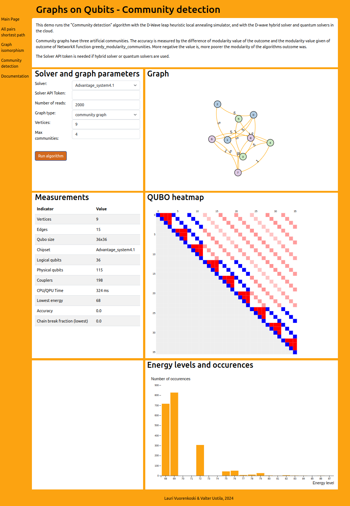

# Graphs on Qubits

This demo run some graph algorithms with quantum annealer (D-Wave). 

Framework: Python / Django / Gunicorn / Bootstrap / D3.js

## Run locally

```
pip install django dwave-ocean-sdk
python manage.py runserver
```

## Docker

### Build

```
sudo docker build -t gq_demo:v0.8 .
```

### Run

```
sudo docker run -p 8000:8000 gq_demo:v0.8
```

After this command application can be accesses from address http://127.0.0.1:8000/

### Dockerhub

https://hub.docker.com/r/vuorenkoski/gq_demo

```
sudo docker pull vuorenkoski/gq_demo:v0.8
sudo docker run -p 8000:8000 vuorenkoski/gq_demo:v0.8
```

